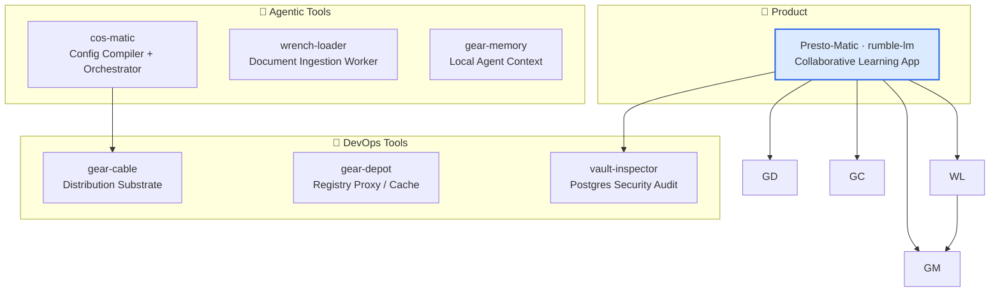

# Presto-Matic

> Sovereign, self-hostable collaborative learning platform — **NotebookLM × Kahoot**: AI-generated, source-grounded study content delivered in real-time sessions for 200+ participants.

[](LICENSE)
[](https://www.rust-lang.org)
[](https://github.com/constantin-jais/rumble-lm/actions/workflows/ci.yml)

> **Status:** `v0.1` — backend/RAG/live-session stable baseline. The live-session tracer bullet is implemented and gated (Biscuit join link, 200 participants, grounded generation, real-time aggregation, leaderboard/load SLOs). Product-complete front, RGPD erasure/audit, and production AI-latency work remain tracked in `docs/`.

## Why it exists

Study platforms either lock you into a vendor's AI stack or lack live collaboration. Presto-Matic is self-hostable with your own AI keys, generates study content grounded in your sources (every item is traceable and agentic-verified), and supports real-time sessions — without compromise on data sovereignty or RGPD compliance.

## Ecosystem



Adjacent tooling lives in separate repos to keep Presto-Matic's runtime boundary tight. See [`docs/adr/0003-companion-repositories.md`](docs/adr/0003-companion-repositories.md).

## Key properties

- **Sovereign / BYO** — self-host on your own infrastructure with your own AI keys. Defaults to Clever Cloud + Clever AI (EU, RGPD).
- **Grounded** — every generated item (quiz, flashcard, summary) is traceable to its source and verified by an agentic grounding checker.
- **Live** — host a session, participants join by link, answer grounded quizzes, watch a real-time leaderboard and comprehension heatmap.

## Architecture

```
┌─────────────────────────────────────────────────────────┐
│                     Presto-Matic                        │
├──────────────┬──────────────────┬───────────────────────┤
│  crates/core │   crates/rag     │    crates/server      │
│  Protocol    │  Ingestion ·     │  axum HTTP/WS ·       │
│  API client  │  Retrieval ·     │  Auth (Biscuit/OIDC)  │
│  WASM        │  Grounded gen ·  │  Session engine ·     │
│  bindings    │  Verification    │  Fanout · Stores      │
└──────────────┴──────────────────┴───────────────────────┘
       │                │                    │
    UniFFI          pgvector             PostgreSQL
    WASM             Redis               Pulsar
                     S3/Cellar
```

## Quick start

```bash
# Clone and build
cargo build --release

# Run backend (requires PostgreSQL, Redis, Pulsar, S3-compatible storage)
cargo run -p server -- --config config/local.toml
```

See [`docs/`](docs/) for full setup instructions including Clever Cloud deployment.

## Tech stack

| Component        | Choice                                       |
| ---------------- | -------------------------------------------- |
| Language         | Rust 2024, edition MSRV 1.95+                |
| HTTP / WebSocket | axum + tokio                                 |
| Database         | PostgreSQL + pgvector                        |
| Object storage   | S3-compatible (Cellar/Clever Cloud default)  |
| Messaging        | Pulsar                                       |
| Cache / KV       | Redis / Materia KV                           |
| Auth             | Biscuit tokens + OIDC / Keycloak             |
| AI               | OpenAI-compatible (Clever AI default)        |
| UI               | Dioxus 0.7 (WASM + native via `crates/core`) |

## Related projects

| Repo                                                                  | Role                                                     |
| --------------------------------------------------------------------- | -------------------------------------------------------- |
| [wrench-loader](https://github.com/constantin-jais/wrench-loader)         | Xberg-backed document ingestion worker for RAG           |
| [gear-memory](https://github.com/constantin-jais/gear-memory)         | Local agent context layer — code map and repo memory     |
| [vault-inspector](https://github.com/constantin-jais/vault-inspector) | Scythe-backed SQL audit and Postgres security inspection |
| [gear-depot](https://github.com/constantin-jais/gear-depot)       | Starmetal-backed sovereign registry proxy                |
| [gear-cable](https://github.com/constantin-jais/gear-cable)           | Multi-platform distribution substrate                    |
| [cos-matic](https://github.com/constantin-jais/cos-matic)     | Config compiler and autonomous CI/CD orchestrator        |

## License

MIT © Constantin Jais
