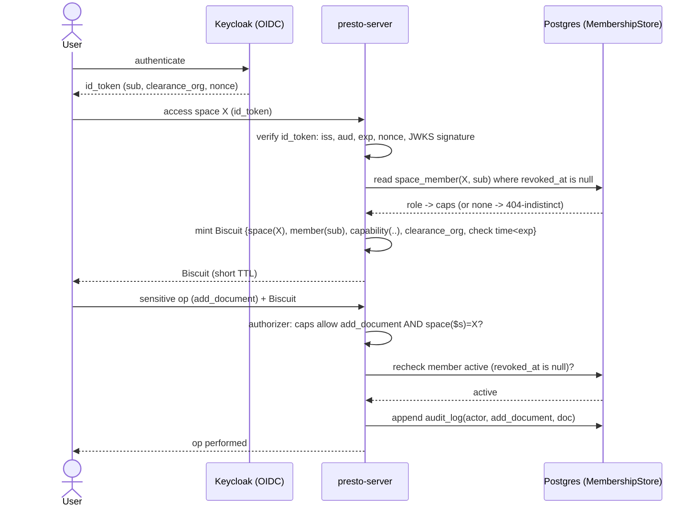

# Collaborative Spaces & Authorization — Design Spec (SP-A)

- Status: Proposed
- Date: 2026-06-28
- Related: docs/specs/2026-06-27-presto-matic-design.md (P4), docs/adr/0001-product-architecture-and-boundaries.md (brick P4), crates/server/src/auth.rs (existing join-link Biscuit)
- Scope: P4 — Sovereignty & Self-host, the **authorization substrate**. Document/space classification (confidentiality / PII / integrity) and clearance-based access are **SP-B**, a separate spec that builds on this one.

## Context

Presto-Matic is a **personal grounded notebook** (the daily surface) with a live-collaboration differentiator on top. The personal notebook is the base; collaboration is the extension. Turning a notebook into a **shared space** — adding members, inviting people on the fly, delegating who may add documents or invite others — requires an authorization substrate that:

- federates identity to a sovereign IdP (Keycloak / OIDC), never reimplementing authn;
- expresses capabilities and delegation with Biscuit (already chosen, already used for live join-links);
- keeps a **single source of truth for membership** (the server's database) and **mints capability tokens at access time** rather than caching permissions inside tokens;
- supports both **durable membership** (a recurring collaborator) and **ephemeral invitation** (a guest of a live meeting), with **immediate revocation**.

`crates/server/src/auth.rs` already mints/verifies Biscuit capability tokens for live join-links: server is sole emitter, Ed25519 keypair (shared across instances via `BISCUIT_PRIVATE_KEY`), injected-clock minting for deterministic expiry, authorizer policies, and a `check if time < expiration` self-expiry. SP-A **generalizes** that from `session` to `space` and adds OIDC identity + attenuation-based delegation. It does **not** rewrite it.

## Goals / Non-goals

**Goals**

- A _space_ (Notebook) that is the unit of ownership, membership, and document scoping — **including the single-member (personal) case**.
- OIDC (Keycloak) authn in front; Biscuit authz behind; membership in Postgres.
- Two invitation regimes: durable membership and ephemeral capability-link.
- Bounded delegation; immediate revocation; an auditable trail of sensitive actions.

**Non-goals** (deferred)

- Document/space classification (confidentiality, PII, integrity) and clearance-gated access — **SP-B**.
- Front-end (Dioxus, design system) — **SP-C**.
- Concurrent collaborative editing (CRDT vs server-authoritative) — separate concern.

## The personal notebook is a single-member space (uniformity)

A solo notebook is **not a separate code path**: it is a `space` whose only `space_member` is the `owner`. Sharing is adding members; live collaboration is opening a `session` inside the space. One model covers solo → shared → live, with no special-casing. This keeps the product's "personal base, collaborative differentiator" gradient as a single mechanism.

## The three layers (invariant)

| Layer                       | Answers                                                     | Lives in               | Must NOT                  |
| --------------------------- | ----------------------------------------------------------- | ---------------------- | ------------------------- |
| **Authn** — Keycloak / OIDC | _who are you_ (identity, org groups, `clearance_org` claim) | sovereign IdP (BYO)    | know what a "space" is    |
| **Membership** — Postgres   | _who is a member of which space, with which role_           | `space_member`         | live in Keycloak          |
| **Authz** — Biscuit         | _what this bearer may do, here, now_                        | token minted at access | be a permission **cache** |

**Core invariant — the token is not a cache.** A Biscuit encodes the capability **minted at access time** from the OIDC identity + the membership read in the DB. Permissions are never "synced" into a long-lived token; the DB stays the authority on _current_ membership. This is what makes immediate revocation possible (see Revocation).

**Space-isolation invariant.** A token minted for space `X` can never operate on space `Y`, enforced in the authorizer by binding the requested space (the generalization of today's `requested_session` check). Every operation states its target space; the authorizer requires `space($s)` in the token to equal the requested space.

## Capability model — roles in front, atomic caps in the token

Roles are the UX/DB vocabulary; the Biscuit reasons in atomic capabilities (attenuation stays fine-grained). The authorizer decides on caps.

| Role        | read | contribute | add_document | invite | manage_members | delete_space |
| ----------- | ---- | ---------- | ------------ | ------ | -------------- | ------------ |
| viewer      | ✓    |            |              |        |                |              |
| contributor | ✓    | ✓          | ✓            |        |                |              |
| inviter     | ✓    | ✓          | ✓            | ✓      |                |              |
| admin       | ✓    | ✓          | ✓            | ✓      | ✓              |              |
| owner       | ✓    | ✓          | ✓            | ✓      | ✓              | ✓            |

Caps are Biscuit facts (`capability("read")`, …), exactly as `auth.rs` encodes `capability("host")`.

**Role-assignment policy (anti-escalation).** Only `manage_members` (admin/owner) may assign or change roles, and **never above one's own role** (an admin cannot mint an owner). No self-promotion. `delete_space` and ownership transfer are owner-only; ownership transfer is an explicit, audited action and an invariant guarantees **exactly one owner** per space at all times.

## Identity — durable vs ephemeral

- **Durable member** = OIDC `sub` (Keycloak). The recurring collaborator; has a `space_member` row.
- **Ephemeral guest** = anonymous pseudonym (as today's join-links). A live-meeting attendee, no account, no durable membership.

## Invitation regimes

Two regimes, mapping personal-base vs live-differentiator.

### Durable membership

An issuer with `invite` resolves the invitee's identity (see Identity resolution), then `INSERT space_member(space_id, sub, role)`. On the invitee's next connection (post-OIDC), the server reads the membership and mints a Biscuit with that membership's caps. Revocation = set `revoked_at`. Re-inviting an existing member is an idempotent upsert (updates the role, audited).

### Capability-link (ephemeral)

A Biscuit **attenuated** from the issuer's token: caps ≤ issuer, **short TTL**, **never** `invite`/`manage_members`. Two flavors:

- **anonymous** → join a live meeting without an account (today's join-link, generalized). Multi-use within TTL (one link, many participants), revocable.
- **invite-to-register** → forces an OIDC login that **creates a durable `space_member`**. **Single-use**: consumed on first successful registration, then its `revocation_id` is burned.

### Identity resolution for invitation

"Add a person" needs to turn a human handle into a `sub`. Two paths:

- **Directory** (intra-org): resolve email/handle against Keycloak (user lookup) → known `sub`, immediate durable membership.
- **External**: no existing `sub` → issue an **invite-to-register** capability-link (sent out-of-band, e.g. email — a product dependency, not part of the authz core); the `sub` is bound when the invitee authenticates.

## Bounded delegation (least-privilege)

- `invite` is **non-delegable by default**: a guest cannot re-invite unless explicitly granted `inviter`/`admin`.
- A capability-link **cannot mint another capability-link** (no re-delegation from a link).
- Biscuit **monotone attenuation** guarantees no delegate exceeds its issuer; the policy fixes _how far_ delegation goes.

## Revocation — short TTL + DB recheck (decided)

- Biscuits carry a **short TTL** (default ~15 min, tunable).
- **Sensitive operations** (`add_document`, `invite`, `manage_members`, `delete_space`, and — via SP-B — reading a confidential doc) **re-check current membership** in the DB before proceeding. A revoked member (`revoked_at IS NOT NULL`) or a revoked link (`revocation_id` in the revocation set) is denied **immediately**, regardless of an unexpired token.
- Non-sensitive reads may rely on the token within its TTL.
- **Rationale:** the token proves identity + caps offline; the DB remains the authority on _current_ membership — immediate revocation at one lookup's cost on sensitive ops. Chosen over **TTL-only** (revocation window = TTL, unsafe for confidential spaces) and **epoch-counter** (space-granularity only, no per-member kick).
- The recheck goes through a **`MembershipStore` trait** (the seam, see Components), so the authorization path is unit-testable without a database and stays consistent with the existing `SessionStore`/`Fanout` seams.

## Components & placement (architecture)

SP-A is **brick P4** taking shape. For now it lives as modules inside `presto-server`:

- `space` — space lifecycle, role/cap mapping, ownership invariant.
- `membership` — the `MembershipStore` trait + Postgres impl + in-memory impl (for tests), mirroring `store.rs`/`postgres_store.rs`.
- `oidc` — id_token verification (discovery, JWKS cache + rotation).
- `auth.rs` — generalized: `space` facts, atomic caps, attenuation, `mint_space_token`.
- `audit` — append-only sink for sensitive actions.

When P4 grows (quotas, RGPD workflows, audit retention), extract a `presto-authz` crate per ADR-0001's boundary principles. Not now.

## Data model

```sql
space (
  id             uuid primary key,
  owner_sub      text        not null,            -- exactly one owner (enforced on transfer)
  name           text        not null,
  created_at     timestamptz not null default now()
);

space_member (
  space_id       uuid        not null references space(id),
  member_sub     text        not null,            -- OIDC subject
  role           text        not null,            -- viewer|contributor|inviter|admin|owner
  invited_by_sub text,
  created_at     timestamptz not null default now(),
  revoked_at     timestamptz,                      -- immediate revocation
  primary key (space_id, member_sub)
);

document (
  id             uuid        primary key,
  space_id       uuid        not null references space(id),  -- documents are scoped to a space
  -- classification columns (confidentiality / pii / integrity) added by SP-B
  created_by_sub text        not null,
  created_at     timestamptz not null default now()
);

capability_link (
  id             uuid        primary key,
  space_id       uuid        not null references space(id),
  caps           text[]      not null,             -- subset of atomic caps, never invite/manage_members
  expires_at     timestamptz not null,
  single_use     boolean     not null default false,
  consumed_at    timestamptz,                       -- set when a single-use link is redeemed
  created_by_sub text        not null,
  revocation_id  text        not null unique,       -- Biscuit revocation id
  revoked_at     timestamptz
);

audit_log (
  id             bigserial   primary key,
  space_id       uuid        not null references space(id),
  actor_sub      text        not null,
  action         text        not null,             -- invite|revoke|role_change|add_document|delete_space|ownership_transfer
  target         text,                              -- affected member_sub / document id (never raw PII payloads)
  at             timestamptz not null default now()
);
```

## Mint / verify flow



## User stories (scope anchor)

- As an **owner**, I create a space (solo by default) and add documents.
- As an **owner/admin**, I invite a person by email — resolved via Keycloak if they exist, else an invite-to-register link.
- As an **owner/admin**, I assign a role no higher than my own, and I can revoke a member with immediate effect.
- As an **inviter**, I generate a capability-link to bring people into a live session on the fly.
- As an **invited member**, I authenticate via my org IdP and gain exactly the caps my role grants.
- As an **owner**, I transfer ownership explicitly; the space always has exactly one owner.
- As a **guest**, I join a live meeting via an anonymous link without an account, and cannot re-invite.

## How it extends `auth.rs`

- **Keep:** server-sole-emitter; Ed25519 keypair from `BISCUIT_PRIVATE_KEY`; injected-clock minting; the authorizer pattern; `check if time < expiration`; `AuthError` never carrying the token.
- **Generalize:** `session(id)` → add `space(id)`; `Capability{Host,Participant}` → atomic caps as `capability("…")` facts; a live token becomes `space(id) + session(id) + caps`.
- **Add:** OIDC verification in front; attenuation for capability-links; `mint_space_token` reading the `MembershipStore`; the sensitive-op recheck; the audit sink.

## Relation to SP-B (classification)

SP-A is the substrate; SP-B layers clearance/classification. The handoff:

- SP-A's Biscuit carries `clearance_org` (a Keycloak claim) as a fact; documents are already scoped to a space (`document.space_id`).
- SP-B adds three **signed** assertions on docs/spaces (`confidentiality`, `pii`, `integrity`) via Biscuit third-party blocks, the policy `allow if clearance >= confidentiality`, the derivation `pii.special => confidentiality >= confidential`, and the anti-escalation invariant `effective_clearance = min(clearance_org, space_grant)`.
- "Can I add this person to a confidential space?" = SP-B policy reading SP-A's membership + clearance.

## Security considerations

- **OIDC validation is explicit and total:** verify `iss`, `aud`, `exp`/`iat`, `nonce` (anti-replay), and signature against cached JWKS with key rotation. Reject otherwise. This is the front gate; under-validating it voids everything downstream.
- **Token theft is a residual risk:** a stolen Biscuit grants its caps until expiry. Mitigations: short TTL, TLS everywhere, sensitive-op recheck (covers revocation, not theft). Token binding (device/mTLS/DPoP-style) is a future hardening, tracked as an open item.
- **Space isolation:** the authorizer binds `space($s)` to the requested space; a token for X cannot act on Y.
- **Capability-links:** invite-to-register links are single-use (burned on redemption); anonymous live links are multi-use within a short TTL; both are revocable via the revocation set, which is durable and checked on every link use.
- **Anti-enumeration:** `not-found` and `forbidden` return an indistinguishable response, so space/document existence cannot be probed.
- **Role/ownership:** no self-promotion; no assigning a role above one's own; exactly one owner; ownership transfer is explicit and audited.
- **Audit:** every sensitive action is appended to `audit_log` (DORA), with no raw PII payloads.
- \*\*Server is the sole emitter; tokens are capability proofs, not caches; monotone attenuation; no PII in logs; secrets (`BISCUIT_PRIVATE_KEY`, OIDC client secret) in env only.

## Testing strategy

- **Unit** (extend `auth.rs` tests, mock `MembershipStore`): mint/verify roundtrip for space caps; attenuation yields a strictly-smaller cap set; a link cannot re-mint a link; expired token rejected; token for space A cannot open space B; role-assignment cannot exceed the issuer's role.
- **OIDC**: reject tokens failing `iss`/`aud`/`exp`/`nonce`/signature; JWKS rotation handled.
- **Integration**: durable invite → member reads; revoke member → sensitive op denied **immediately** despite an unexpired token; anonymous link join; invite-to-register single-use (second redemption denied); guest cannot invite; ownership transfer keeps exactly one owner; `not-found` indistinguishable from `forbidden`.
- **Multi-instance**: token minted by instance 1 verified by instance 2 (shared key) — extend existing coverage to space tokens.

## Open items

- Exact Biscuit TTL (default ~15 min) — tune against recheck cost under load.
- OIDC library (e.g. `openidconnect` crate) — validate against docs.rs at implementation; confirm Keycloak discovery/JWKS flow.
- Token binding (device/mTLS/DPoP-style) — future hardening against token theft.
- Revocation-set storage for capability-links (Redis set vs Postgres) — measure.
- Migration of existing `session`-only state into a default space.
- Quotas (members per space, spaces per user, links per space) — abuse/tiering; coordinate with P4 quota work.
- Invitation notifications (email/in-app) — product dependency outside the authz core.
- Whether `clearance_org` is minted into SP-A's token now or only in SP-B (leaning: SP-A mints the fact, SP-B adds the policy).

```

```
