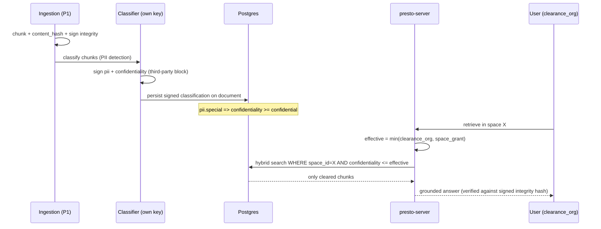

# Signed Classification & Clearance-Based Access — Design Spec (SP-B)

- Status: Proposed
- Date: 2026-06-28
- Related: docs/specs/2026-06-28-collaborative-spaces-authz-design.md (SP-A, the substrate), docs/specs/2026-06-27-presto-matic-design.md (P1 ingestion, P4 sovereignty), docs/adr/0001-product-architecture-and-boundaries.md
- Scope: the classification layer over SP-A — **what is in a document/space and who is cleared to see it**. Depends on SP-A (spaces, membership, `clearance_org`, documents scoped to a space).

## Context

SP-A answers _who may operate on a space_. SP-B answers _what a document/space is, and whether a given person is cleared for it_ — and therefore **whether you can add someone to a space** at all. This is the "sign the risk level" requirement, reframed: not one scalar, but **three orthogonal signed assertions**.

## Three orthogonal signed assertions (NOT one "risk level")

A single "risk level" conflates three things that live on different axes and are consumed differently. Each is a **separate signed assertion** on a document (and an aggregate on the space):

| Assertion           | Answers                     | Type                                                       | Drives                                               |
| ------------------- | --------------------------- | ---------------------------------------------------------- | ---------------------------------------------------- |
| **confidentiality** | _who may see it_            | ordered level: `public < internal < confidential < secret` | access policy `clearance >= confidentiality`         |
| **pii**             | _what legal obligations_    | `{present, categories[]}` (incl. RGPD art. 9 special)      | RGPD workflows + **derives** a confidentiality floor |
| **integrity**       | _is it authentic/unaltered_ | `{content_hash, source, signature}`                        | ingestion gate + grounding honesty                   |

They are linked by **derivation, not fusion**: `pii.special ⇒ confidentiality ≥ confidential` (automatic). Comparing `clearance >= X` is meaningful **only** for confidentiality.

## Who classifies, who signs (separation of powers)

- **confidentiality** — assigned by owner/admin at the **space** level (default), optionally overridden **upward** per document (never below the space floor). Signed by the server authority.
- **pii** — detected **automatically at ingestion** (a PII classifier over the chunked text), signed by a **dedicated classification service with its own keypair** (the server cannot forge a PII verdict).
- **integrity** — `content_hash` computed at ingestion over canonicalized content + source; signed by ingestion.

**Biscuit realization.** Classification assertions are persisted on the document **and** attestable as **Biscuit third-party blocks**: the classifier's key signs `pii(...)`/`confidentiality(...)`, ingestion's key signs `integrity(...)`. The authorizer verifies them against the signers' public keys — **offline, independent of the main server's trust**. This makes a classification tamper-evident and cross-service verifiable (a member cannot downgrade confidentiality to exfiltrate).

## Clearance — hybrid with the anti-escalation invariant

- `clearance_org` = a Keycloak claim (the **ceiling** a subject may ever reach), carried as a fact in the SP-A Biscuit.
- `space_grant` = a per-space clearance set in the DB (membership-level), which may only **restrict**.
- **`effective_clearance = min(clearance_org, space_grant)`** — a space can never raise a subject above the org ceiling. Biscuit attenuation realizes the `min()` natively (the token starts at the org ceiling and is only restricted per space).

## Access policy

- **Read a document:** `allow if effective_clearance >= document.confidentiality`. Retrieval is filtered by **both** `space_id` (SP-A) **and** `confidentiality <= effective_clearance` — an under-cleared member never retrieves a chunk above their level (the anti-exfiltration property, enforced in the query, not the UI).
- **Add a person to a space** (the original ask): `allow if invitee.effective_clearance(space) >= space.max_confidentiality`. You cannot invite someone the space's content out-clears.



## Live generation gate (cross-spec: SP-B × live P3 × SP-A)

A live session **generates** grounded content and **broadcasts** it to participants — including anonymous guests whose clearance is `public`. SP-B gates _reading_ a confidential document, but **generation-then-broadcast is a separate, unguarded path**: a quiz grounded on a confidential corpus would exfiltrate it to anonymous participants through the generated questions.

**Rule:** a host may generate live content only from sources whose `confidentiality ≤ min(clearance of the present audience)` — `public` for anonymous guests. **The live grounding inherits the audience ceiling, not the corpus level.** Enforced server-side at generation time (the retrieval that feeds a live generation is filtered by the audience's minimum clearance, not the host's). This closes the SP-B × P3 × SP-A intersection.

## PII / RGPD workflows

- **Detection** at ingestion: categories (identity, contact, and art. 9 special: health, religion, biometrics, …). Signed verdict.
- **Obligations triggered**: data minimization; configurable retention; **right-to-erasure** (delete a PII document → cascade to chunks/embeddings → audit); processing register; **no PII in logs** (CLAUDE.md).
- **DORA**: access to confidential/PII documents is audited (via SP-A's `audit_log`).

## Integrity & the grounding wedge

The `content_hash` signed at ingestion lets the **grounding-verifier** (the product wedge) assert not just "supported by the source" but "supported by the source **as ingested, unaltered**". A chunk whose live hash diverges from its signed hash is rejected and cannot ground a generation. Provenance (source) travels with it.

## Delivery increments (aligned with SP-A — gating is collaborative, integrity is solo)

**Access classification only engages once a space is shared (SP-A inc-2):** in a solo space the single owner sees everything, so confidentiality/clearance gate nothing. **Integrity** is the exception — it serves the grounding wedge from the solo notebook.

- **Increment 1 — integrity for grounding (with SP-A inc-1 / solo):** signed `integrity` (content hash + provenance) at ingestion; the grounding-verifier asserts "supported by the source _as ingested, unaltered_". No access gating yet.
- **Increment 2 — confidentiality gating (with SP-A inc-2 / collaboration):** manual space-level confidentiality + `allow if clearance_org >= confidentiality` + retrieval filter + the invitation gate. The minimum for a shared confidential space. Clearance = `clearance_org` only.
- **Increment 3 — PII, hybrid clearance & live gate:** automatic PII detection + confidentiality-floor derivation + RGPD workflows; third-party-block classifier (separate key); hybrid `effective = min(org, grant)`; the **live-generation gate** (below); SP-A transport hardening keyed off `confidentiality`.

## Data model (extends SP-A `document`)

```sql
alter table document
  add column confidentiality  text not null default 'internal',  -- public|internal|confidential|secret
  add column pii_present       boolean not null default false,
  add column pii_categories    text[] not null default '{}',
  add column integrity_hash    text,                              -- content hash, signed
  add column classification_sig bytea;                            -- signer attestation over (id, conf, pii, hash)

-- space carries the aggregate ceiling for invitation gating
alter table space
  add column max_confidentiality text not null default 'internal';

-- membership carries the per-space grant (clearance restriction)
alter table space_member
  add column space_grant text;  -- null => inherit clearance_org; else min() applies
```

The pgvector corpus chunk rows carry `confidentiality` (denormalized from the document) so the retrieval filter is a single indexed predicate.

**Dependency invariant (ADR-0001).** The `Level` type (`public < internal < confidential < secret`) lives in **`presto-core`** (transverse), and the `Retriever` (P1/`corpus.rs`) receives `max_confidentiality` as an **opaque parameter** computed server-side. The corpus never depends on the authz/classification crate — `confidentiality` is data flowing in, not a code dependency `rag → P4`.

## Security considerations

- **Tamper-evidence:** classification is signed by a key distinct from the main server (classifier) — the server cannot forge a downgrade.
- **Anti-escalation:** `min(clearance_org, space_grant)`; a space owner cannot mint clearance the IdP never granted.
- **Anti-exfiltration:** confidentiality filtering happens in the retrieval query, not the UI; an under-cleared member's RAG answers can never cite over-level chunks.
- **No PII in logs**; right-to-erasure cascades to embeddings; classifier key rotation and revocation handled like the Biscuit emitter key.
- **Derivation safety:** the PII→confidentiality floor is applied at signing time, so a doc cannot be both `pii.special` and `public`.

## Testing strategy

- Unit: confidentiality ordering; `min()` clearance; `pii.special` forces the floor; signature verification (valid/forged/rotated key).
- Integration: under-cleared member's retrieval excludes over-level chunks; invitation denied when invitee out-cleared by space; erasure cascades to chunks/embeddings + audit; integrity-mismatch chunk rejected from grounding.
- Cross-spec (with SP-A): adding a person is gated by both membership caps (SP-A) and clearance (SP-B).

## Open items

- PII classifier implementation (rules vs model) and its sovereignty (must run on Clever/EU; BYO).
- Confidentiality taxonomy granularity (4 levels vs org-defined).
- Signed-classification storage format (inline third-party block vs detached signature + DB).
- Erasure vs grounding: a cited-then-erased source — invalidate dependent generated content? (coordinate with SP-A audit + P2 studio).
- Classifier key management / rotation cadence.
